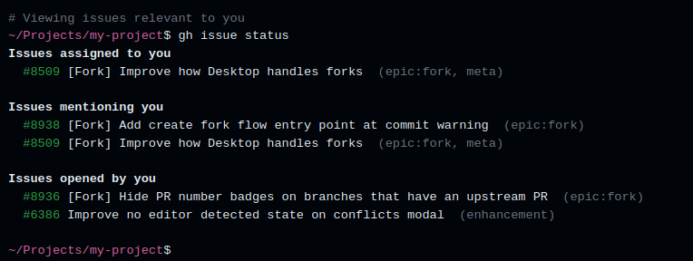
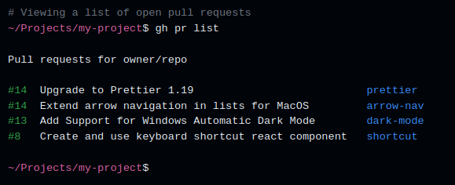

## Table of contents

- [Intoduction](./Intro_CLI_eng)
- [CheatSheet](./README.md)
- [Installation](./installCLI.md)
- BaseUse
    - [Authentication](#auth)
    - [Managing repositories](#repo)
    - [Managing issues](#issues)
    - [Managing pull requests](#pr)
    - [Managing workflows](#workflows)


  # **Base use of GitHub CLI**

GitHub CLI (**gh**) is a command-line tool that brings GitHub functionality to your terminal.This GitHub operations <br> without interacting with the graphical interface and remaining focused on the terminal.

## Basic command CLI

### <a id=auth></a> **Authentication :**

Enter <code>gh auth login</code> and follow the prompts to log in using your GitHub ID

```
gh auth login <flag>
```


  Options  |  Description 
  ---| ---
```gh auth login --hostname github.example.com --web```| Authentificate without additional command


<br>
You can enter <code>gh auth logout</code> to log out.

### <a id=repo></a> **Managing Repository :**

Enter <code> gh repo create </code> to create a repository.<br>
``` gh repo create ``` : create a repository 

  

  Options | Description
  --- | ---
  ```-p```,```--template <repository>```|Make the new repository based on template repository.
  ```-t```,```team <name>```| The name of the organization team to be granted access
  ```-c```,```--clone```| Clone the new repository to the current directory
<br>

+ ```gh repo fork [<repository>] [flag]``` : to Fork a repository
+ ```gh repo clone [<repository>] [<directory>]``` : Clone a repository
+ ```gh repo view [<repository>] [flag]``` : view a repository

**Example for** : ```gh repo fork```

 

**Example for** : ```gh repo fork cli/cli``` : a flags to fork and clone directly


**Example for** : ```gh repo clone``` 


  Options | Description
  --- | ---
  ``` -b ```,``` --branch <string>``` | View a specific branch of repository,
  ``` -w ```,``` --web``` | Open a repository in the browser
<br>

### <a id=issues></a> **Managing Issues**

  - ```gh issue create [flag]``` : create an issue

  Options | Description
  --- | ---
  ```-t```, ```title <string>```| Supply a title
  ```-l```, ```label <name>``` | Add labels by name
  ```-a```, ```assignee <login>``` | Assigne People by their login? Use "@me" to self-assign

  **Example for** : ``` gh issue create ``` : 

  

  **Example for** : ``` gh issue create [flags] ``` : 

  

  - ```gh issue list [flag]```: List issues

  Options | Description
  --- | ---
  ```-a```, ``` --assignee <string>``` | Filter by assignee
  ```-A```, ``` --author <string>``` | Filter by author
  ```-s```, ``` --state <string> (default "open")``` | Filter by state: {open\|closed\|all}
  ```-l```, ``` --label <strings>``` | Filter by label

  **Example for** : ``` gh issue list ``` :

  

  **Example for** : ``` gh issue list [flags] ``` :

  

  - ```gh issue status``` : Show status of relevant issues
  ```gh issue view {<number> | ur>} [flags]``` : view a specific issue

  Options | Description
  --- | ---
  ```-c```,```--comments``` | View issue comments

  **Example for** : ```gh issue status``` :

  

  ```issue close {<number> | <url>} [flags]``` : Close issue

  Options | Description
  ---| ---
  ```-c```, ``` --comment <string> ``` | Leave a closing comment
  ```-r```, ``` --reason <string>``` | Reason for closing

  <br>

### <a id=pr></a>**Managing pull requests**

  - ```gh pr create [flags] ```: create a pull request

  Options | Description
  --- | ---
  ```-B```, ``` --base <branch>``` | The branch into which you want your code merged.
  ```-f```, ``` --fill ``` | Use commit info for title and body 
  ```-l```, ``` --label <name> ``` | add labels by name

  **Example for** : ``` gh pr create```: 

  

  **Example for** : ``` gh pr create [flag] ```:

  

  - ```gh pr list [flags]``` : List pull request

  Options | Description 
  --- | ---
  ```-a ```,```--assignee <string>``` | Filter by assigne
  ```-A```, ``` -- author <string> ``` | Filter by author
  ```-s```, ```--state <string> (default "open")``` | Filter by state : {open\|closed\|merged\|all}
  ```-l```,```--label <strings>``` | Filter by label

  **Example for** : ```gh pr list ```: 

  

  **Example for** : ```gh pr list [flag]``` :

  

  - ```gh pr status``` : Show status of relevant pull request
  - ```gh pr view {<number> | <url> | <branch>} [flags]``` : View a specific pull request

  Options | Description
  --- | ---
  ```-c```,```--comment <string>``` | Leave a reopening comment

  **Example for** : ```gh pr status``` :

  

  **Example for** : ```gh pr view ``` : 

  

  **Example for** : ```gh pr view <number> ```:<br> but we can add other arguments like "Url" and "branch".

  

### <a id=workflows></a>**Managing workflows**

  - ```gh workflow list [flag]``` : List workflow files, hiding disabled workflows by default

  Options | Descripstion
  --- | ---
  ```-a```, ```--all``` | Include disabled workflows

  - ```gh workflow view [<workflow-id> | <workflow-name | <filename>] [flags]```: View the summary of a workflow
  - ```gh workflow run [<workflow-id> | <workflow-name>]``` : execute a workflow
  - ```gh workflow enable [<workflow-id> | <workflow-name>]``` : Enable a workflow, allowing it to be run
  - ```gh workflow disable [<workflow-id> | <workflow-name>]``` : Disable a workflow, preventing it from running

  **Example for** : ```gh workflow run [flag]``` :

  